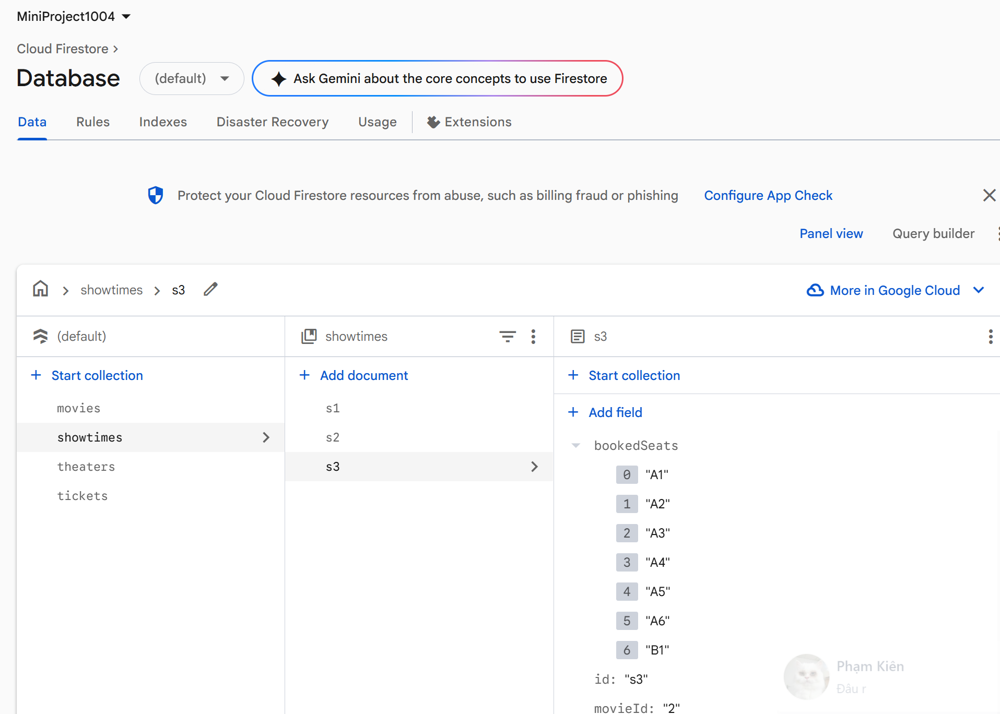
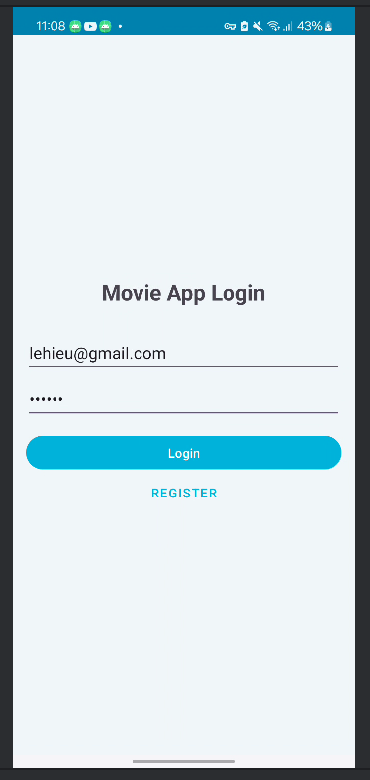
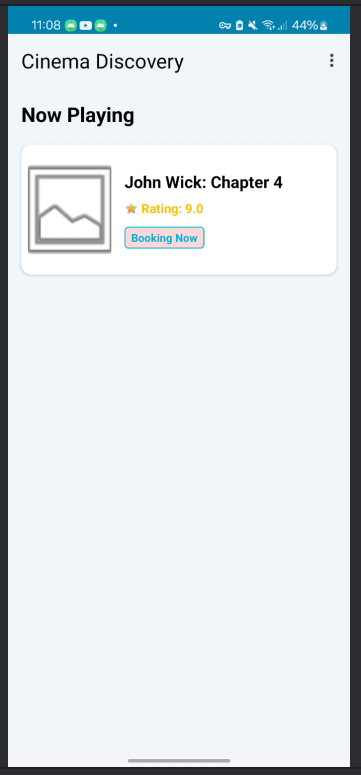
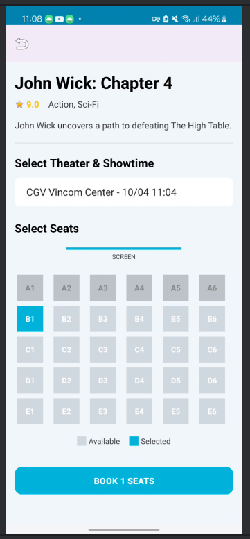
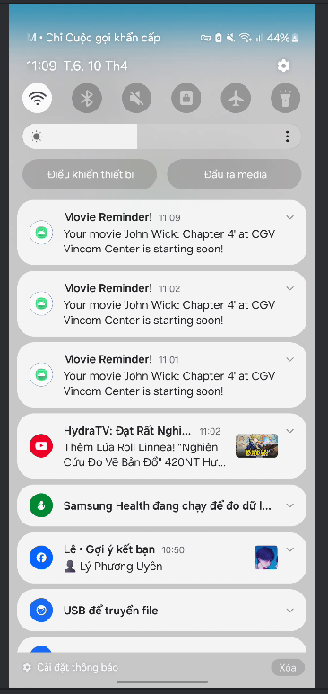

# MiniProject1004 - Movie Booking App

Ứng dụng Android đặt vé xem phim tích hợp Firebase, cung cấp trải nghiệm hiện đại và tiện lợi cho người dùng.

## 🚀 Chức năng chính

*   **Xác thực Firebase**: Đăng nhập và Đăng ký tài khoản riêng biệt. Thông tin người dùng được đồng bộ hóa với Firestore.
*   **Khám phá Phim**: Xem danh sách các bộ phim đang chiếu với giao diện thẻ hiện đại, hỗ trợ tải ảnh mượt mà qua Glide.
*   **Đặt vé chi tiết**:
    *   Xem thông tin phim, rating và mô tả.
    *   Chọn rạp và suất chiếu linh hoạt từ danh sách.
    *   **Sơ đồ ghế ngồi**: Chọn ghế trực quan qua bảng lưới (Grid). Ghế đã đặt sẽ tự động bị khóa (Unavailable).
*   **Quản lý vé**: Lưu trữ thông tin vé (Phim, Rạp, Ghế, Giá vé) trực tiếp trên Cloud Firestore.
*   **Lịch sử đặt vé**: Xem lại toàn bộ danh sách vé đã mua, sắp xếp theo thời gian.
*   **Thông báo nhắc nhở**: Tự động gửi thông báo (Push Notification) nhắc giờ chiếu trước 15 phút sau khi đặt vé thành công.

## 🛠 Công nghệ sử dụng

*   **Ngôn ngữ**: Java / XML
*   **Backend**: Firebase (Authentication, Cloud Firestore, Cloud Messaging)
*   **Thư viện**: Glide (Load ảnh), Material Design, RecyclerView, CoordinatorLayout.

## 📂 Cấu trúc Cơ sở dữ liệu (Firestore)

*   `users`: Lưu thông tin định danh người dùng.
*   `movies`: Danh sách phim và thông tin chi tiết.
*   `theaters`: Danh sách các rạp chiếu phim.
*   `showtimes`: Lịch chiếu kết nối Phim + Rạp + Trạng thái ghế.
*   `tickets`: Lưu trữ lịch sử giao dịch của người dùng.

## 📸 Hình ảnh giao diện

### 1. Quản lý dữ liệu trên Firebase

### 2. Màn hình Đăng nhập

### 3. Danh sách Phim đang chiếu

### 4. Đặt vé & Chọn ghế

### 5. Thông báo nhắc lịch chiếu

---
*Phát triển bởi [Tên của bạn]*
